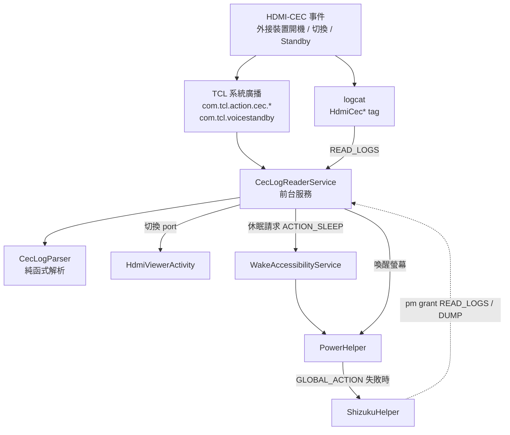
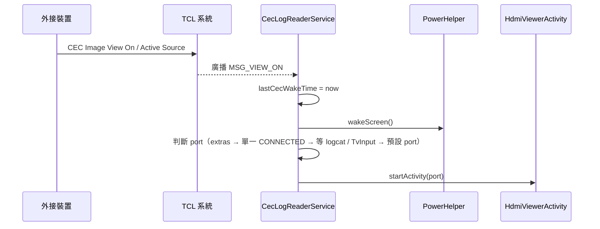
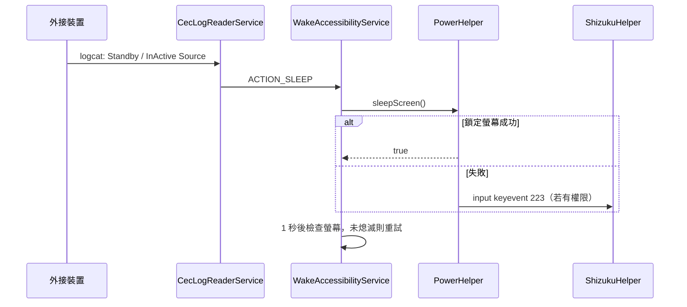

# 架構說明

本文說明 TCL HDMI Launcher 的程式結構，以及三個最容易混淆的子系統：
**CEC log 讀取**、**無障礙服務**與 **Shizuku** 如何分工、何時啟用、彼此怎麼互相配合。

## 1. 要解決的問題

TCL 電視的原生桌面與 HDMI-CEC 行為有幾個限制，這個 App 要補起來：

| 需求 | 原生行為 | 本 App 的做法 |
| --- | --- | --- |
| 開機 / 待機喚醒後進入自己的桌面 | 回到 TCL 桌面 | `BootAndWakeReceiver`、`TclHdmiApplication`、`WakeAccessibilityService` 把 Launcher 拉回前景 |
| 外接裝置（Apple TV 等）透過 CEC 開機後直接顯示該 HDMI | 常停在桌面，或切到錯誤 port | `CecLogReaderService` 判斷來源 port，開啟 `HdmiViewerActivity` |
| 外接裝置發出 Standby 時電視跟著休眠 | 沒有可用的公開 API | 無障礙服務執行鎖定螢幕 / 電源選單；失敗時退回 Shizuku shell |
| 遙控器 Home / Input 鍵 | 開啟原生桌面或訊號源選單 | 無障礙服務攔截按鍵事件 |

## 2. 套件結構

```text
com.lnu.tclhdmilauncher
├── (根套件)  Manifest 對外入口與全域共用工具
│   ├── MainActivity               HOME / LEANBACK_LAUNCHER 入口
│   ├── HdmiViewerActivity         以 TvView 顯示指定 HDMI port（adb 與 CEC 都會呼叫）
│   ├── WakeAccessibilityService   無障礙服務
│   ├── BootAndWakeReceiver        開機 / 喚醒廣播（靜態註冊）
│   ├── TclHdmiApplication         全域狀態、動態螢幕廣播接收器、啟動 CEC 服務
│   ├── DeviceHelper               品牌 / 機型偵測
│   └── Extensions                 共用擴充函式
├── cec/            CecLogReaderService、CecLogParser、CecDebugLog、CecDebugActivity
├── accessibility/  AccessibilityHelper（檢查 / 引導開啟無障礙服務）
├── power/          PowerHelper（喚醒 / 休眠）、PowerMenuClicker
├── shizuku/        ShizukuHelper
├── settings/       SettingsRepository 與各設定頁、OobeActivity
├── applist/        App 模式的清單頁
└── launcher/       主畫面 Compose UI
```

> **為什麼有些類別留在根套件？**
> `MainActivity`（預設桌面）、`HdmiViewerActivity`（文件中的 `adb shell am start -n`）與
> `WakeAccessibilityService`（系統把元件名稱存進 `ENABLED_ACCESSIBILITY_SERVICES`）
> 的完整類別名稱已被系統或使用者持久化。搬動套件會讓既有使用者的預設桌面與無障礙設定失效，
> 因此這些元件的名稱不能變。其餘內部類別可自由移動。

## 3. 三個子系統的分工



### 3.1 CEC log 讀取（`cec/`）

`CecLogReaderService` 是一個**前台服務**，由 `TclHdmiApplication.onCreate()` 啟動，
負責「偵測 CEC 事件並決定要做什麼」。它同時使用三種資訊來源，因為單一來源都不可靠：

1. **logcat**（需要 `READ_LOGS`）：讀取 `HdmiCec*` 等 tag，由 `CecLogParser` 解析出
   `Image View On`、`Active Source`、`Routing Change`、`Standby`、`InActive Source`。
   Active Source / Routing Change 的實體位址第一個 nibble 就是 TV 的 HDMI port
   （`10 00` → HDMI 1、`30 00` → HDMI 3）。
2. **TCL 系統廣播**（動態註冊）：`MSG_VIEW_ON`、`MSG_ACTIVE_SOURCE`、`MSG_ROUTING_CHANGE`、
   `MSG_SET_STREAM_PATH`、`com.tcl.voicestandby`。
   Android 8+ 不允許靜態接收器收隱式廣播，App 進程在待機被回收後會漏收，
   所以必須在前台服務裡動態註冊（且在 Android 13+ 要標示 `RECEIVER_EXPORTED`）。
3. **`TvInputManager` 狀態**：port 狀態從 `STANDBY` 變成 `CONNECTED` 時代表該 port 剛被喚醒。

`MSG_VIEW_ON` 通常不帶 port，因此依序嘗試：

1. intent extras 內的 port 或實體位址 →
2. 只有一個 HDMI port 為 `CONNECTED` →
3. 等待 `TvInputCallback` 或 logcat 的 `Active Source`（最多 1.5 秒）→
4. 逾時後退回設定中的預設 port。

只要上述任一路徑確定了 port，就取消其他等待中的路徑，避免重複切換。
所有決策都會寫入 `CecDebugLog`，可在「CEC Debug」頁面查看。

`TclHdmiApplication.lastCecWakeTime` 是跨元件共用的「最近一次 CEC 喚醒」時間戳記。
在 15 秒內，`BootAndWakeReceiver`、`WakeAccessibilityService` 與 Home 鍵攔截都會**放行**，
不再把 Launcher 拉回前景，避免蓋掉 CEC 剛切好的訊號源。

### 3.2 無障礙服務（`WakeAccessibilityService`）

這個服務有三個用途，**都不依賴 root 或 Shizuku**：

- **按鍵攔截**：`onKeyEvent` 攔截 Home / Guide / TV 與 Input 鍵，改開本 App。
- **桌面重新導向**：`onAccessibilityEvent` 偵測系統桌面視窗（TCL 桌面、Google TV 桌面）
  出現時，把畫面導回本 Launcher；從本 App 啟動的外部 App 有 5 秒豁免
  （`temporarilyIgnorePackage`）。
- **休眠**：`CecLogReaderService` 收到 Standby / Inactive Source 後，送出 `ACTION_SLEEP` 給這個服務，
  由 `PowerHelper.sleepScreen()` 依序嘗試：
  1. `GLOBAL_ACTION_LOCK_SCREEN`（Android 9+）
  2. `GLOBAL_ACTION_POWER_DIALOG` 並由 `PowerMenuClicker` 點擊「休眠 / 關機」
  3. `input keyevent 223`（有 Shizuku 權限時走 Shizuku，否則走本地 shell），仍未熄滅再試 `keyevent 26`

  螢幕未熄滅時每秒重試一次，最多重試 3 次；5 秒內的重複請求會被忽略。

若使用者沒有啟用無障礙服務，CEC 切換與喚醒仍可運作，但休眠與按鍵攔截不可用，
`CecLogReaderService` 會在 CEC Debug 中記錄原因並顯示提示。
`AccessibilityHelper` 負責檢查狀態與引導使用者到系統設定頁。

### 3.3 Shizuku（`shizuku/`）

Shizuku 是**可選的特權通道**，用來取得一般 App 拿不到的權限。本 App 只用在三件事：

| 用途 | 呼叫端 | 說明 |
| --- | --- | --- |
| 自動授權 `READ_LOGS`、`DUMP` | `MainActivity`、`ShizukuSettingsActivity` → `tryGrantPermissions` | 沒有 `READ_LOGS` 時，`CecLogReaderService` 讀不到 logcat（也可改用 `adb shell pm grant`） |
| 以 shell 身分執行 `input keyevent` | `PowerHelper`（喚醒 / 休眠的後備方案） | 無障礙動作失敗時才使用 |
| 凍結 / 解凍 App（`pm disable-user`） | `AppListActivity` | App 模式中的管理功能 |

`ShizukuHelper` 另提供下載並安裝 Shizuku APK 的流程，供設定頁使用。
注意：`executeShellCommand` 透過反射呼叫 `Shizuku.newProcess`，
升級 Shizuku API 版本時需重新確認該方法仍然存在。

## 4. 典型流程

### 外接裝置開機 → 自動切換到該 HDMI



### 外接裝置關機 → 電視休眠



## 5. 設定與狀態

- **使用者設定**一律透過 `SettingsRepository` 存取，不要直接呼叫 `getSharedPreferences`。
  會在喚醒路徑被頻繁讀取的值有記憶體快取；`resetAllSettings()` 會同時清除快取與儲存。
- **CEC 除錯紀錄**（`CecDebugLog`）刻意與使用者設定分開存放，最多保留 60 筆。
- **背景工作**使用綁定服務生命週期的 `CoroutineScope`（`CecLogReaderService`、
  `WakeAccessibilityService`），在 `onDestroy` 取消，不要再直接建立裸 `Thread`。

## 6. 測試

| 類型 | 位置 | 執行方式 |
| --- | --- | --- |
| JVM 單元測試 | `app/src/test` | `./gradlew :app:testDebugUnitTest` |
| 裝置 UI 測試 | `app/src/androidTest` | `./gradlew :app:connectedDebugAndroidTest`（需要裝置或模擬器） |

目前單元測試涵蓋 `CecLogParser`（CEC 事件與 port 解析）與 `SettingsRepository`（預設值、快取、重設）。
新增與 CEC 判斷相關的規則時，請優先把邏輯寫成不依賴 Android framework 的純函式，才能用單元測試保護。
